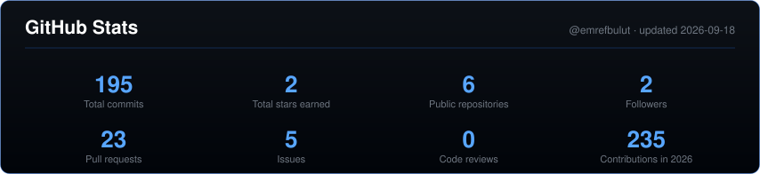
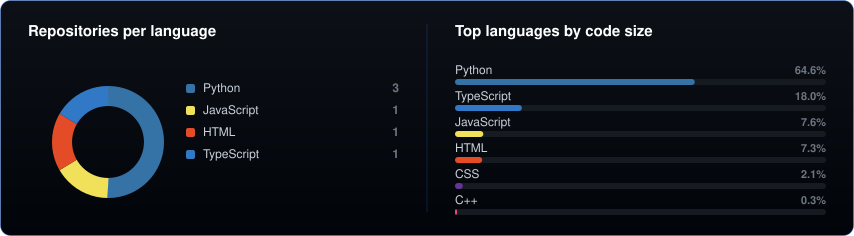
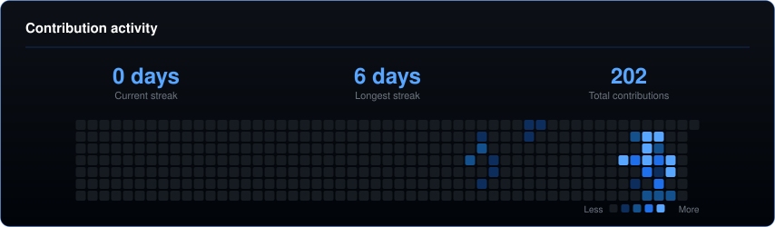

 

&nbsp;

&nbsp;

&nbsp;

&nbsp;

  

---

## About me

I'm an Electrical & Electronics Engineering student at **Istanbul Medipol University**, based in Istanbul, Türkiye. My focus is bringing **AI, deep learning and LLMs** into **RF and microwave engineering** 

- **AI & deep learning** — model training, fine-tuning, dataset engineering, LLMs
- **RF & microwave** — SDR/IQ signal processing, SigMF pipelines, machine learning on RF
- **Hardware–software integration** — edge deployment, embedded control, telemetry
- **Systems & infrastructure** — virtualization, Linux administration, network topology

---

## Featured Projects

<table>
<tr>
<td width="50%" valign="top">

<h3 align="center"><a href="https://github.com/emrefbulut/iqforge">IQForge</a></h3>

  
  

My first <b>published Python package</b> — <code>pip install iqforge</code>. Splitting SDR recordings at the <b>window</b> level lets neighbouring windows leak across train and test, inflating reported accuracy by up to <b>13.6 points</b>. IQForge splits at the <b>recording</b> level instead, reads SigMF directly, balances metadata that would otherwise create hidden correlations, and fails loudly rather than degrading silently when stratification is impossible.

</td>
<td width="50%" valign="top">

<h3 align="center"><a href="https://github.com/emrefbulut/RoomGate-AI">RoomGate&#8209;AI</a></h3>

  

A smart access and occupancy system that turns detections into physical action. An edge-optimized <b>YOLO26</b> detector with spatial region-of-interest filtering drives a relay-based lock, so the vision pipeline and the door stay in sync instead of drifting apart.

</td>
</tr>
<tr>
<td width="50%" valign="top">

<h3 align="center"><a href="https://github.com/emrefbulut/IoT-Smart-Energy-Monitor">IoT Smart Energy Monitor</a></h3>

  

Three layers, one loop: an <b>ESP32 + PZEM&#8209;004T</b> front end for raw AC measurement, a Python bridge computing active/apparent/reactive power and cumulative kWh, and a live dashboard on top. Anomalies raise alerts, events are written asynchronously to SQLite in WAL mode, and load shedding is guarded by hysteresis and a confirmation window.

</td>
<td width="50%" valign="top">

<h3 align="center"><a href="https://github.com/emrefbulut/VoltPilot">VoltPilot</a></h3>

  

Sites planning EV charging investments rarely know in advance whether their grid connection can take the load. VoltPilot simulates it before anything is installed — transformer loading, battery dispatch, virtual grid signals, telemetry validation and generated engineering reports, so the decision rests on data instead of a guess.

</td>
</tr>
</table>

---

## Tech Stack

<table>
<tr>
<td align="right" valign="middle"><b>AI &amp; Deep Learning</b></td>
<td></td>
</tr>
<tr>
<td align="right" valign="middle"><b>RF &amp; Signal Processing</b></td>
<td></td>
</tr>
<tr>
<td align="right" valign="middle"><b>Languages</b></td>
<td></td>
</tr>
<tr>
<td align="right" valign="middle"><b>Hardware &amp; IoT</b></td>
<td></td>
</tr>
<tr>
<td align="right" valign="middle"><b>Systems</b></td>
<td></td>
</tr>
<tr>
<td align="right" valign="middle"><b>Data &amp; Tooling</b></td>
<td></td>
</tr>
</table>

---

## GitHub Stats

